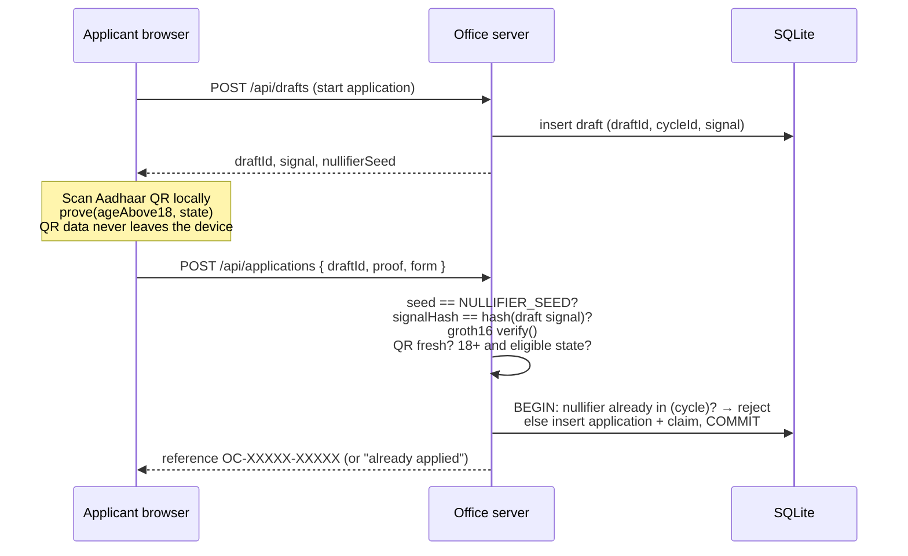

# One Claim: Nobody Needs Your Aadhaar Number

**One application per person per benefit cycle, with no Aadhaar number collected.** Applicants prove eligibility with an [Anon Aadhaar](https://documentation.anon-aadhaar.pse.dev/) zero-knowledge proof generated in their own browser. The office learns only the answer to a yes/no question ("18 or older, and living in the configured state?"). It never learns who the applicant is.

Built for Kavita's office, which runs benefit application cycles with volunteers.

---

## What it does and why

| Idea                              | What it means here                                                                                                                                                                                                                                                                                              |
| --------------------------------- | --------------------------------------------------------------------------------------------------------------------------------------------------------------------------------------------------------------------------------------------------------------------------------------------------------------- |
| **A yes/no answer, not a person** | The applicant scans their Aadhaar secure QR code in the browser. A ZK proof reveals only two outputs: `ageAbove18` and `state`. Name, DOB, gender, PIN code, photo and Aadhaar number never leave the device.                                                                                                   |
| **Nullifier**                     | Each proof contains a nullifier: a pseudonym derived from the applicant's Aadhaar identity and the office's seed. The same person always gets the same nullifier for this office, so a second application in a cycle is recognised and turned away. The nullifier cannot be turned back into an Aadhaar number. |
| **Seed fixed by the office**      | The nullifier seed comes from the server's `NULLIFIER_SEED`. Proofs made with any other seed are rejected, so an applicant can't switch seeds to get a new pseudonym and a second slot.                                                                                                                         |
| **Server-side verification**      | The server runs the Anon Aadhaar groth16 `verify()` itself before recording anything. It never trusts a validity flag from the browser.                                                                                                                                                                         |
| **Signal bound to one draft**     | Before proving, the server creates an application draft and derives a signal for it. The proof commits to that signal, so a proof can't be replayed on a different application.                                                                                                                                 |



---

## Quick start

Requirements: Node.js 20+ (tested on Node 24) and npm.

```bash
npm install
cp .env.example .env.local
```

Edit `.env.local`:

| Variable             | What to put there                                                                                                                                                                  |
| -------------------- | ---------------------------------------------------------------------------------------------------------------------------------------------------------------------------------- |
| `NULLIFIER_SEED`     | A random integer. Generate one with `node -e "console.log(BigInt('0x'+require('crypto').randomBytes(16).toString('hex')).toString())"`. Keep it stable for the life of the office. |
| `ELIGIBLE_STATE`     | The state applicants must live in. Use `Delhi` with test QR codes.                                                                                                                 |
| `USE_TEST_AADHAAR`   | `true` for demos (SDK test key), `false` for real Aadhaar QR codes.                                                                                                                |
| `QR_MAX_AGE_SECONDS` | Reject QR codes signed longer ago than this. Default `3600`. Use `0` to disable.                                                                                                   |
| `VOLUNTEER_PASSWORD` | A long passphrase that volunteers use to open the dashboard.                                                                                                                       |
| `SESSION_SECRET`     | 32+ random characters used to sign the volunteer session cookie.                                                                                                                   |
| `DATABASE_PATH`      | SQLite file, created on first run. Default `./data/one-claim.db`.                                                                                                                  |

```bash
npm run dev
# applicants:  http://localhost:3000/apply
# volunteers:  http://localhost:3000/volunteer
```

---

## Running a cycle end to end (volunteer guide)

1. **Log in.** Open `/volunteer` and enter the volunteer password. You stay signed in for 8 hours through a secure cookie.
2. **Open a cycle.** Give it a name (for example `October 2026 food support`) and click **Open cycle**. Only one cycle can be open at a time.
3. **Share the link.** Send applicants the `/apply` link (print it as a QR poster, send it on WhatsApp, and so on).
4. **Applicants apply.** Each applicant:
   - answers two non-identifying questions (household size, type of support needed),
   - clicks **Continue to eligibility proof**, which makes the server issue a draft,
   - uploads their Aadhaar secure QR code in the Anon Aadhaar window. The QR is read and proven **inside their browser**, and only the proof is sent,
   - receives a reference like `OC-7K2QD-M9XPA`, which they keep for pickup.
5. **Watch the dashboard.** The counters show:
   - **Verified entries**: proofs that verified and took a slot,
   - **Duplicates turned away**: second attempts by someone who already has a slot this cycle,
   - **Left to review**: verified applications still pending your decision.
6. **Review.** Click **Approve** or **Reject** on each application. You see only the reference, the answers and the time. There's no name or number to look up, and that's intentional.
7. **Close the cycle.** Click **Close cycle** when intake ends. New submissions are refused. When you open a new cycle, everyone can apply once again.

---

## Test-mode walkthrough (no real Aadhaar needed)

1. In `.env.local`, set `USE_TEST_AADHAAR=true` and `ELIGIBLE_STATE=Delhi`. The SDK's test identity lives in Delhi.
2. Start the app, log in at `/volunteer` and open a cycle.
3. Generate a **fresh** test QR at <https://documentation.anon-aadhaar.pse.dev/docs/generate-qr>. Click **Generate New Value** and save the QR image. The proof carries the QR's signing time (rounded down to the hour by the circuit, which the server allows for), and with `QR_MAX_AGE_SECONDS=3600` a QR signed more than about an hour ago is refused, so generate a new one if yours is old.
4. Go to `/apply`, answer the two questions, click **Start application**, then upload the saved QR image in the Anon Aadhaar window and generate the proof.
   - The first run downloads the circuit artifacts (tens of MB). Proving takes about 1–3 minutes, depending on the device.
5. Submit. You get a reference number, and the dashboard shows **Verified entries: 1**.
6. **Try to cheat.** Apply again with the same QR (or a freshly generated test QR, which is the same test person) in the same cycle. The proof verifies, but the nullifier is already on record, so you see "You already have an application in this cycle" and **Duplicates turned away** goes up.
7. Close the cycle and open a new one. The same person can apply once in the new cycle.

To see the eligibility rule reject an applicant, set `ELIGIBLE_STATE` to another state (for example `Kerala`) and restart. The test proof then comes back ineligible.

---

## Production notes

- Set `USE_TEST_AADHAAR=false`. Only QR codes signed by UIDAI's production key are accepted then. Applicants download their secure QR from the mAadhaar app ([Android](https://play.google.com/store/apps/details?id=in.gov.uidai.mAadhaarPlus) / [iOS](https://apps.apple.com/in/app/maadhaar/id1435469474)).
- Keep `NULLIFIER_SEED` **stable** and treat it as semi-secret. Changing it gives everyone a new nullifier, and every past record stops matching.
- Serve the app over HTTPS. The volunteer cookie is marked `Secure` in production.
- Back up the SQLite file (`DATABASE_PATH`). The `claims` table is the record of who has taken a slot.
- Use a long, unique `VOLUNTEER_PASSWORD` and `SESSION_SECRET`, and never commit `.env.local`.

---

## What the office stores (and never stores)

| Stored (SQLite)                                                    | Never stored, logged or received                       |
| ------------------------------------------------------------------ | ------------------------------------------------------ |
| Cycles (name, open/closed, timestamps)                             | Aadhaar number                                         |
| Drafts (random `draftId`, cycle, server-derived signal)            | QR code contents or image                              |
| Applications (reference, household size, support category, status) | Name, DOB, gender, PIN code, address, photo, phone     |
| Claims: `(cycle_id, nullifier) → application`                      | UIDAI certificate or signature                         |
| Count of duplicate attempts per cycle (a timestamp only)           | The proof itself (checked, then discarded; not logged) |
|                                                                    | Email, phone, IP address, device ID or wallet          |

---

## How each guarantee is enforced

| #   | Guarantee                                            | Where                                                                                                                                                                                                                                                                                                                      |
| --- | ---------------------------------------------------- | -------------------------------------------------------------------------------------------------------------------------------------------------------------------------------------------------------------------------------------------------------------------------------------------------------------------------- |
| 1   | **One claim per human per cycle (stored nullifier)** | `lib/intake.ts`: `recordOnce` runs `hasTakenSlot(cycle_id, nullifier)` **before** inserting, inside one SQLite transaction, and rejects a match as `duplicate`. `lib/db.ts`: `claims` has `UNIQUE (cycle_id, nullifier)` as a backstop. Duplicates are keyed only on the nullifier, never on email, session, IP or device. |
| 2   | **Nullifier seed fixed by the app**                  | `lib/config.ts` parses `NULLIFIER_SEED` from the server env. `lib/intake.ts` BigInt-compares `proof.nullifierSeed` to it and rejects `seed_mismatch`. `app/api/drafts/route.ts` hands the seed out, and the browser never chooses it. The contract holds it as `immutable nullifierSeed`.                                  |
| 3   | **Proof verified server-side**                       | `app/api/applications/route.ts` (the only recording path) calls `lib/intake.ts` `submit()` with `lib/verifier.ts`, which runs `init()` with `artifactUrls.v2` and then `verify()` from `@anon-aadhaar/core`, before anything is recorded. A throw or `false` is rejected as `invalid_proof`.                               |
| 4   | **Eligibility from the verified proof**              | `lib/intake.ts` requires `proof.ageAbove18 === '1'` and `convertRevealBigIntToString(proof.state)` to equal `ELIGIBLE_STATE`, both read from the verified public signals. It never reads form fields, cookies or the client-built `claim`.                                                                                 |
| 5   | **Signal bound to the application**                  | `lib/store.ts` `createDraft` issues a random `draftId` and `lib/signal.ts` `deriveSignal(cycleId, draftId)` builds its signal. `lib/intake.ts` compares `proof.signalHash` to `signalHashOf(draft.signal)` (the SDK `hash`) and rejects `signal_mismatch`. Drafts are single-use and expire after 60 minutes.              |
| 6   | **Raw Aadhaar data never leaves the device**         | `components/apply/*` posts only `{ draftId, proof, form }` and requests only `revealAgeAbove18` and `revealState` (no gender or PIN code). The server keeps only the nullifier and the form answers, and never logs the proof.                                                                                             |
| 7   | **Proof generated in the applicant flow**            | `components/apply/*` uses `AnonAadhaarProvider` (`_useTestAadhaar`) and `LogInWithAnonAadhaar` with the server-issued `nullifierSeed` and `signal`. The applicant uploads their own QR. There are no mocked proofs in the app path.                                                                                        |
| 8   | **No credentials in tracked files**                  | `.env.example` has placeholders only. `.gitignore` covers `.env*` (except the example), `node_modules`, `*.db`, `data/`, `artifacts`, `cache`. Hardhat tests use the in-process network; no private keys or seed phrases appear anywhere in the repo.                                                                      |

---

## Smart contract (optional on-chain path)

`contracts/OneClaimRegistry.sol` enforces the same rules on-chain:

- verifies proofs through the Anon Aadhaar verifier interface (`IAnonAadhaar.verifyAnonAadhaarProof`),
- passes its own **immutable `nullifierSeed`** to the verifier, never a caller-supplied seed,
- requires the proof's signal to equal the application-derived value for the claim,
- reads eligibility from `revealArray` (`ageAbove18 == 1`, `state ==` the configured packed state),
- keeps `mapping(uint256 cycle => mapping(uint256 nullifier => bool))`, which is read before write and reverts on a second claim.

`contracts/mocks/MockAnonAadhaar.sol` stands in for the real verifier in tests.

```bash
npm run chain:compile
npm run chain:test
```

The web app is the primary intake path. The contract shows how the same guarantees carry over to a chain-based registry.

---

## Quality gates

```bash
npm run check
# = format:check → lint → chain:compile → typecheck → test (vitest) → build (next build) → chain:test
```

The unit tests (`test/unit/`) cover the intake service with an injected verifier. They check that a duplicate nullifier is rejected, a seed mismatch is rejected, a signal mismatch is rejected, an ineligible applicant is rejected, an invalid proof is rejected, and the happy path records exactly once. The Hardhat tests (`test/contracts/`) cover the registry against a mock verifier.

---

## Project layout

```
app/
  page.tsx                      landing page
  apply/page.tsx                applicant entry (server: reads open cycle + test mode)
  volunteer/page.tsx            volunteer dashboard (server-checked session)
  api/drafts/route.ts           POST: issue draft + signal for the open cycle
  api/applications/route.ts     POST: verify proof server-side and record once
  api/volunteer/*               login/logout, open/close cycle, approve/reject
components/
  apply/*                       Anon Aadhaar provider + proving flow (client)
lib/
  config.ts                     server env: seed, eligible state, test mode, QR max age
  signal.ts                     draft → signal derivation, SDK signal hash
  db.ts                         SQLite schema (claims UNIQUE(cycle_id, nullifier))
  store.ts                      cycles, drafts, applications, stats
  intake.ts                     the recording service (all checks, one transaction)
  verifier.ts                   Anon Aadhaar init + verify (groth16)
  session.ts, volunteer-auth.ts volunteer password + signed httpOnly cookie
contracts/
  OneClaimRegistry.sol          on-chain registry
  mocks/MockAnonAadhaar.sol     test verifier
test/
  unit/                         vitest (intake service)
  contracts/                    hardhat tests
```

---

## Known limitations

- **The browser SDK logs to the console.** `@anon-aadhaar/react` writes its own proof state to the applicant's browser console and `localStorage`. That's the proof (public signals), not QR data, and the app logs out of the SDK after submitting. This server never logs proofs.
- **Nullifiers depend on the seed.** A nullifier is determined by (Aadhaar identity, seed). Rotating `NULLIFIER_SEED` gives everyone a fresh pseudonym and makes past claims unmatchable, so don't rotate it mid-cycle.
- **Turn test mode off in production.** With `USE_TEST_AADHAAR=true`, anyone can make test QR codes. It exists for demos only.
- **One device, one browser.** Proving needs a reasonably modern phone or laptop, and slow connections make the first artifact download take a while.
- **SQLite suits a single server.** For several app instances, move the same schema and the same transaction to Postgres.
